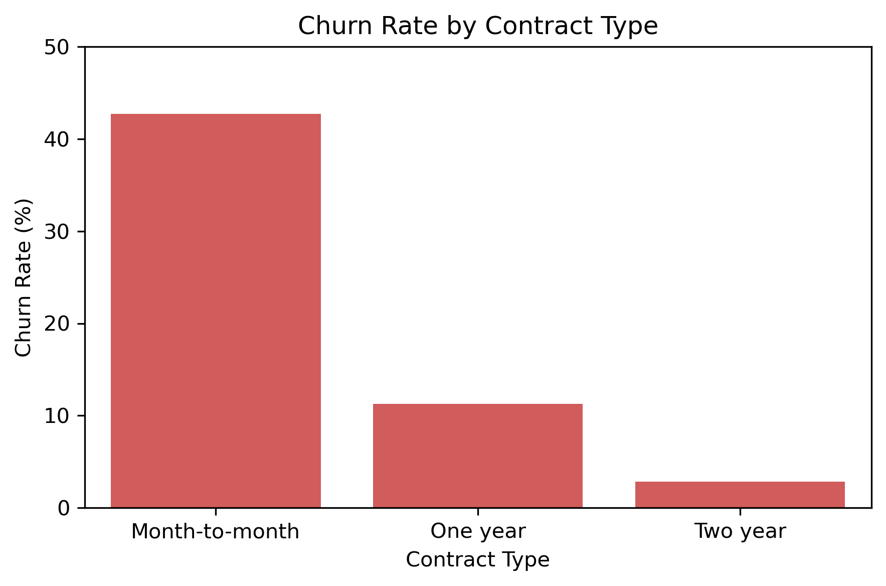
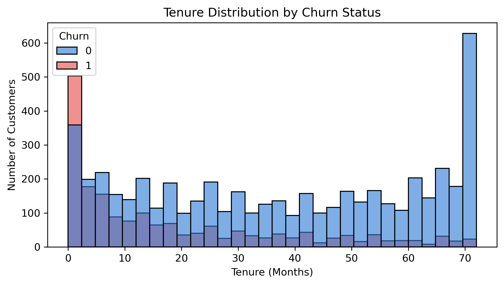
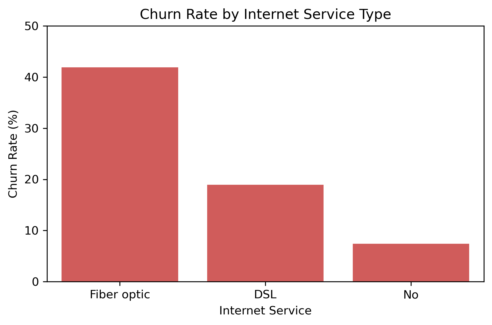
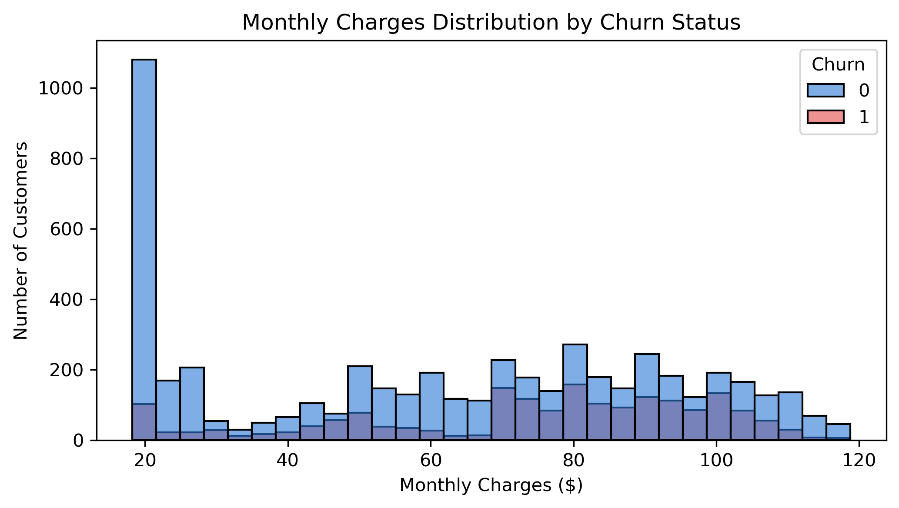
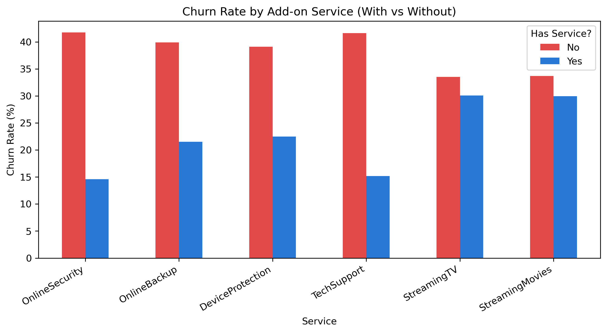
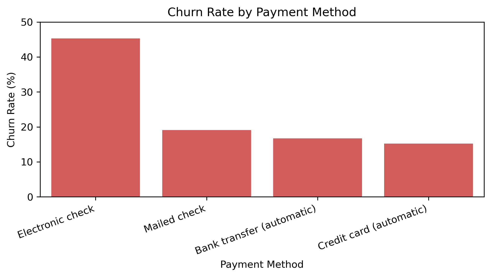
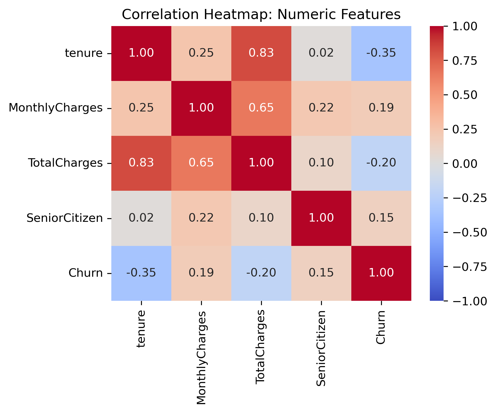

# Telco Customer Churn Prediction
 
A complete, end-to-end machine learning project predicting customer churn for a telecom company, using the IBM Telco Customer Churn dataset (7,043 customers, 21 original features).
 
## Project Overview
 
The goal: identify which customers are likely to churn, so a business could proactively target them with retention efforts. This project walks through the full data science lifecycle — cleaning, exploratory analysis, multicollinearity diagnostics, feature encoding, model comparison, and tuning — with every decision explained and justified rather than applied blindly.
 
## Dataset
 
- **Source:** [IBM Telco Customer Churn dataset](https://www.kaggle.com/datasets/blastchar/telco-customer-churn) (Kaggle)
- **Size:** 7,043 customers, 21 columns
- **Target:** `Churn` (Yes/No) — 26.5% churn rate (imbalanced)
- **Features:** Customer demographics, subscribed services (phone, internet, streaming, security add-ons), contract/billing details, and charges
## Data Cleaning
 
| Issue | Fix | Reasoning |
|---|---|---|
| `TotalCharges` stored as text, 11 hidden blank entries | Converted to numeric; blanks filled with 0 | All 11 blanks belonged to customers with `tenure = 0` — nothing billed yet |
| `customerID` unique per row | Dropped | Identifier, no predictive value |
| `Churn` stored as Yes/No text | Mapped to 1/0 | Numeric target required for modeling |
| Remaining categorical columns | Checked for inconsistencies | Confirmed clean — no stray whitespace or typos |
 
## Exploratory Data Analysis
 
Six key findings, each backed by a chart and cross-checked with statistical tests where relevant:
 
1. **Contract type is the strongest driver of churn.** Month-to-month customers churn at 42.7%, vs 11.3% (one-year) and 2.8% (two-year) — a ~15x gap between extremes.
   
2. **New customers are the highest-risk group.** Median tenure for churned customers is 10 months, vs 38 months for retained customers.
   
3. **Fiber optic customers churn far more than DSL or no-internet customers** (41.9% vs 19.0% vs 7.4%), tracking closely with average monthly price ($91.50 vs $58.10 vs $21.08) — consistent with cost sensitivity as a driver.
   
4. **Churned customers pay more on average** ($74.44/month vs $61.27), though the effect is partially masked in the raw distribution by a large cluster of low-cost, low-churn customers.
   
5. **Protective/support add-ons correlate with retention; entertainment add-ons barely do.** Customers without OnlineSecurity, TechSupport, OnlineBackup, or DeviceProtection churn 17–27 points more than customers with them. StreamingTV/StreamingMovies show almost no gap (~3 points).
   
6. **Electronic check payers churn more than any other payment method** (45.3%, vs 15.2–19.1% for other methods) — the only manual, recurring payment method in the group.
   
**Numeric correlations with churn:** tenure (r = -0.35), TotalCharges (r = -0.20), MonthlyCharges (r = +0.19).
 

 
**Important caveat — overlapping features:** Chi-square tests confirmed `PaymentMethod` and `InternetService` are not independent of `Contract` (both p ≈ 0). 78.2% of Electronic check users are month-to-month, and 68.7% of Fiber optic customers are month-to-month. This means several "independent" findings are partly re-expressions of the same underlying Contract/tenure pattern rather than fully separate causes.
 
**Working profile of a high-risk customer:** new, month-to-month, fiber optic internet, paying by electronic check, without security/support add-ons, paying a premium monthly price.
 
## Multicollinearity Check (VIF)
 
Ran Variance Inflation Factor to numerically confirm feature overlap suspected during EDA. The first pass revealed **infinite VIF** on several columns — proof that the "No internet service"/"No phone service" categories in seven service columns were exact duplicates of information already captured by `InternetService`/`PhoneService`. These were collapsed into a simple Yes/No, resolving the infinite values. Remaining moderate overlap (e.g. `MonthlyCharges`, which is essentially a calculated total of subscribed services) was kept rather than dropped, and handled by comparing a linear model against a tree-based model rather than trimming features.
 
## Preprocessing
 
- **Encoding:** Binary columns mapped to 1/0; multi-category columns (`Contract`, `InternetService`, `PaymentMethod`) one-hot encoded to avoid implying a false numeric order.
- **Train/test split:** 80/20 stratified split (preserves the 73.5/26.5 churn ratio in both sets).
- **Scaling:** `StandardScaler` applied to continuous columns (`tenure`, `MonthlyCharges`, `TotalCharges`), fit only on training data to avoid data leakage.
## Model Comparison
 
Five models were trained and evaluated, using precision/recall/F1 rather than accuracy alone, given the class imbalance:
 
| Model | Accuracy | Churn Precision | Churn Recall | Churn F1 |
|---|---|---|---|---|
| Logistic Regression (balanced) | 74.0% | 0.51 | 0.79 | 0.62 |
| Random Forest (balanced, base) | 79.5% | 0.65 | 0.49 | 0.56 |
| Gradient Boosting (unweighted) | 79.8% | 0.66 | 0.51 | 0.57 |
| Gradient Boosting (weighted) | 74.3% | 0.51 | 0.80 | 0.62 |
| **Random Forest (tuned)** | **75.6%** | **0.53** | **0.80** | **0.64** |
 
**Key finding:** switching algorithms alone had limited impact — weighted Gradient Boosting and Logistic Regression converged on nearly identical results. The class-imbalance handling strategy mattered more than the choice of algorithm. Across all models, there's a consistent trade-off frontier around ~80% recall/~50% precision or ~65% precision/~50% recall — no configuration broke past both simultaneously.
 
### Hyperparameter Tuning
 
Used `GridSearchCV` (5-fold cross-validation) to tune Random Forest, optimizing for recall. Best parameters: `max_depth=5, min_samples_leaf=1, min_samples_split=10, n_estimators=100`. This produced the best overall result — matching the top recall seen elsewhere (0.80) while also improving precision and accuracy, rather than trading one for another.
 
### Feature Engineering
 
Tested three new features: average monthly spend, total add-on service count, and a tenure life-stage grouping. **None improved model performance** — results were flat to slightly worse across both Random Forest and Logistic Regression. Likely explanation: the engineered features were largely redundant with information the models already had access to (e.g. tree-based models can approximate ratios like average spend on their own), and one feature (service count) may have lost meaningful detail by combining columns of unequal importance.
 
## Final Model
 
**Tuned Random Forest**, using only the original cleaned and encoded features:
- Accuracy: 75.6%
- Churn precision: 0.53
- Churn recall: 0.80
- Churn F1: 0.64
### Feature Importance
 
The model's top predictors closely matched the EDA findings — `TotalCharges`, `tenure`, and `MonthlyCharges` together account for ~51% of the model's decisions, followed by `Contract`, `InternetService`, and `PaymentMethod`.
 
## Business Interpretation
 
This model is tuned to prioritize **recall** — catching as many actual churners as possible — on the reasoning that losing a paying customer is typically more costly than a false alarm (e.g. an unnecessary retention outreach). The precision/recall balance is adjustable via threshold tuning depending on the actual cost structure of retention efforts, which would ideally be confirmed with business stakeholders before deployment.
 
## Tools Used
 
Python, pandas, NumPy, scikit-learn, statsmodels, Matplotlib, Seaborn
 
## Project Structure
 
```
├── telco_churn_analysis.ipynb    # Full analysis notebook
├── WA_Fn-UseC_-Telco-Customer-Churn.csv
├── images/                       # Exported chart images
└── README.md
```
 
## Key Takeaways
 
- Multicollinearity checks caught a real structural issue (duplicate information across 7 columns) that simple correlation checks alone would have missed.
- Model comparison revealed that imbalance-handling strategy mattered more than algorithm choice.
- Feature engineering isn't automatically valuable — it needs to add information a model can't already infer, and this project documents an honest case where it didn't.
